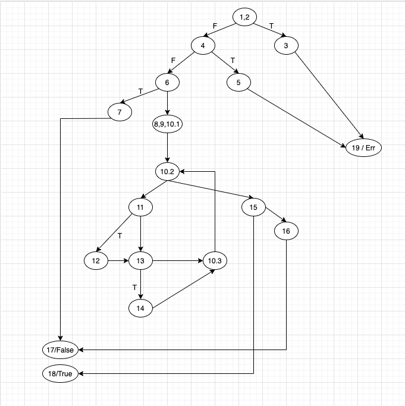

# Втора лабораториска вежба по Софтверско инженерство

## Иван Китановски, бр. на индекс 131119

### Група на код

Ја добив групата на код 2

### Control Flow Graph

### Цикломатска комплексност

Цикломатската комплексност на овој код е 5, истата ја добив преку формулата V(G) = E - N + 2, каде што E е бројот на ребра додека N е бројот на јазли.
V(G) = 22 - 19 + 2 = 5

### Тест случаи според критериумот Every branch

* function(null, []);
1,2,3,19

* function(new User(null, "pass", "ivan@yopmail.com"), [])
1,2,4,5,19

* function(new User("Ivan", null, null), [])
1,2,4,6,7,17

* function(new User("Ivan", "pass", "ivan@yopmail.com"));
1,2,4,6,8,9,10.1, (10.2, 11, 12, 13, 14, 10.3, 10.2), 15,18

* function(new User("Ivan", "pass", "ivan@yopmailcom"));
1,2,4,6,8,9,10.1, (10.2, 11, 13, 10.3, 10.2) 16, 17

### Тест случаи според критериумот Multiple conditions

#### (user.getUsername()==null || allUsers.contains(user.getUsername()))

* function(new User(null, "pass", "ivan@yopmail.com"), null);
* function(new User("Ivan", "pass", "ivan@yopmail.com"), [new User("Ivan", "pass2", "test@yopmail.com")]);
* function(new User("Ivan", "pass", "ivan@yopmail.com"), []);

#### (!atChar || !dotChar)

* function(new User("Ivan", "pass", "ivanyopmail.com"))
* function(new User("Ivan", "pass", "ivan@yopmailcom"))
* function(new User("Ivan", "pass", "ivan@yopmail.com"))

### Објаснување на напишаните unit tests

...
...
